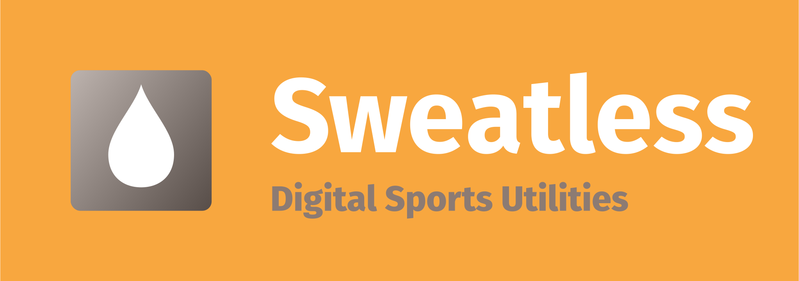

## What is Sweatless?
Sweatless is a collection of tools for tracking your training and setting up workout plans from your own collection of exercises in a quick and easy way. It is based on my experience with using Google Sheets for this purpose and bundles the functionality I needed for my strength and running workouts into a simpler and cleaner user interface.

### Planned features
- Configurable training type
- Exercise database and workout plans

### Training logging and statistics

Conceptually this is a **complement to your usual running-/sports-tracking mobile apps** which give you a lot of quantitative metrics of individual activities and visualisations of those but lack in the qualitative dimension i.e. what training goal a workout actually has. Even when you don't have particularly ambitious goals you will quickly come to a point where you don't do the same kind of training every time (e.g. slow runs that are longer and faster ones over a short distance). Only when you pair your individual workouts with the other numbers you get **information that is actually useful**. Now you can answer questions like *"Did I neglect my high-intensity workouts last month?"* with ease. This is why the core of Sweatless are **configurable training types**. Your entire log history is calculated into a handful of percentages and totals that help you decide what to do on the day without following a strict plan. They also provide some visualisation of your progress to help keep you motivated without overdoing metrics-based self-analysis. Another function that I found very useful is being able to combine your logs quickly and easily with free text notes. Especially when you are having injury problems this can be very revealing and **helpful when talking to doctors**.

Feel free to [contact me](#contactinfo-heading) with ideas for improvement.

