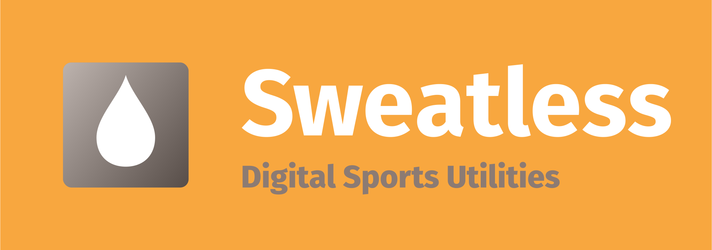

## What is Sweatless?
Sweatless is a collection of tools for tracking your training and setting up workout plans from your own collection of exercises in a quick and easy way. It is based on my experience with using Google Sheets for this purpose and bundles the functionality I needed for my strength and running workouts into a simpler and cleaner user interface.

## Development

### Planned features
- Configurable training type
- Exercise database and workout plans

### Structure
Frontend and backend are set up as seperate folders on the top level to ease navigation, enable easy development with docker-compose and npm-workspaces, prevent conflicts with different IDE-Plugin configurations (esp. ESLint and Prettier) in nested directories and to make possible future deployment as microservices easier (although not yet intended). To accomodate this with docker the docker compose file uses two seperate Sub-Dockerfiles in each directory while the production image is built with the top-level file and merges the build-files of the frontend into the backend.

### Deployment
To run in production a JWT-secret and the MongoDB-URL need to be passed as environment variables:

`
DB_URL="mongodb+srv://sweatless-1:<PASSWORD>@<USER>.zqz7g.mongodb.net/<DATABASE>?retryWrites=true&w=majority"
`

`
JWT_SECRET="<HASH>"
`
### Issues
- Live-reload via react-scripts/webpack-dev-server currently doesn't work inside a container (possibly because of max_file_watchers?)
